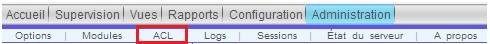
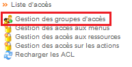
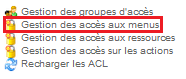
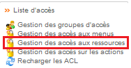
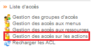

.. _ref_acl:

*********
Les ACLs
*********

Les ACL (Access Control List) permettent de limiter l’accès à des ressources, menus et/ou actions, nous allons voir dans ce chapitre comment les mettre en place.
Nous prenons pour exemple une région qui aura le droit d’accéder uniquement à ses équipements, par exemple: la région de Paris, PARIS.
Dans le menu centreon, cliquer sur Administration ==> ACL

La gestion des groupes d'accès
-------------------------------

Nous allons commencer par le premier menu, "Gestion des groupes d’accès" :

Voici les principales informations:
	* Nom du groupe : 	"Paris_tech"
	* Alias :			"Paris_tech"
	* :ref:`Contacts liés <ref_users>` :		"Tech_Paris"

Pour l'onglet "Autorisations":
	* :ref:`Accès aux ressources <acces_ressources>` :		"Paris_ressources"
	* :ref:`Accès aux menus <acces_menu>` :		"Menu_Sup"
	* :ref:`Actions autorisées <acces_actions>` :		"Simple User"

.. _acces_menu:

Gestion des accès aux menus
-----------------------------

Voici les accès aux menus que nous avons configurés pour les techniciens de Paris:
	* Les pages disponibles : Accueil & Supervision

.. _acces_ressources:

Gestion des accès aux ressources
---------------------------------

Pour cet accès, nous avons inclus tous les hôtes excepté le serveur Centreon, "Centreon-Server".
Et inclus tous les services.

.. _acces_actions:

Gestion des accès sur les actions
----------------------------------

Nous avons, pour les techniciens, utilisé le groupe "Simple User".
Voici ce qu'ils ont droit de faire :
Dans le menu "Accès aux fonctionnalités globales", ils ont vu sur tout sauf "Afficher la liste des collecteurs (pas de collecteur dans l'architecture).

Dans le menu "Accès aux actions sur les services":
	* Acknowledge a service (Acquitter un service)
	* Disaknowledge a service
	* Re-planifier la prochaine vérification d'un service
	* Re-planifier la prochaine vérification d'un service (Forcé)
	* Ajouter/Supprimer un commentaire pour un service

Dans le menu "Accès aux actions sur les hôtes":
	* Acquitter un hôte
	* Disaknowledge a host
	* Planifier la prochaine vérification d'un hôte
	* Planifier la prochaine vérification d'un hôte (Forcé)
	* Ajouter/Supprimer un commentaire pour un hôte
