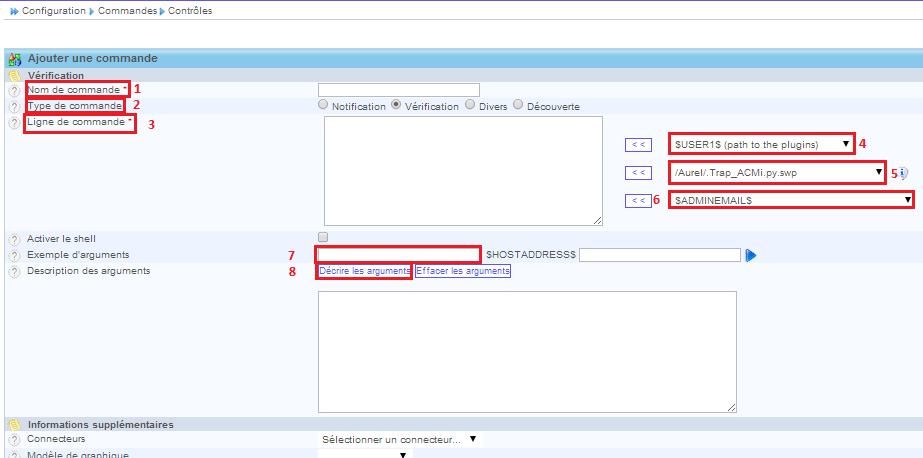

.. _ref_commandes:

****************
Les commandes
****************

Les commandes utilisent des plugins (scripts) pour valider l'état d'un équipement, comme le ping ou la charge CPU.
Elles fonctionnent un peu comme les commandes shell, c'est-à-dire, qu'elles prennent des options ou arguments, comme l'adresse IP de l'équipement, la communauté, version snmp, …

C'est un des point les plus important dans Centreon (Nagios). Ce sont elles qui interogerons les équipements par le biais d'un service.

Les commandes sont utilisées dans :ref:`les services <ref_service>` ou les event handlers.
Dans celles-ci, nous utilisons des "macros", c'est une option qui va changer de valeur suivant le contexte. Nous avons par exemple une macro "$HOSTADRESS$, qui va récupérer l'adresse IP de l'équipement pour qui on va lancer la commande.

Voici les principales informations pour la création d'une commande.

	#. Le nom de la commande, utilisé dans :ref:`les services <ref_service>`.
	#. Dans la plupart des cas le type de commande sera "Vérification"
	#. Dans cette partie nous indiquons le plugin utilisé avec ces options éventuelles.
	#. Ici nous trouvons une macro "$USER1$ qui donne le chemin par défaut des plugins de Nagios/Centreon ("/usr/lib/nagios/plugins")
	#. Ici nous indiquons le plugin que nous voulons utiliser.
	#. Dans ce menu, nous voyons les macros que nous pouvons utiliser, comme $HOSTADDRESS$, $_HOSTSNMPCOMMUNITY$, $ARGn$ utiliser pour des options qui seront à changer si nécessaire, comme les seuils (le n est à changer par un nombre)
	#. Ici, nous indiquons un seuil ou option par défaut, surtout lors d'utilisation de la macro $ARGn$.
	#. Ici nous décrivons les arguments qui utilisent les macros $ARGn$.

Nous verrons en détail comment remplir tous ces champs par la suite lorsque nous expliquerons les commandes personnelles.

check_traffic
--------------

Cette commande va permettre de récupérer la bande passante de chacun de nos ports sur chacun de nos routeurs/commutateurs, ainsi que son état administratif (up/down) et opérationnel (up/down).
Par exemple, si notre port est dans l'état opérationnel est UP et que l'état administratif est DOWN, le service retournera un état CRITIQUE idem s'il dépasse les seuils définis pour la bande passante.
Dans ce projet, nous voulons être au courant lorsqu'un port est ouvert mais que rien n'est racordé dessus

Le plugin utilisé est "/usr/lib/nagios/plugins/check_iftraffic3.pl" un peu remanié par rapport à l'original. Nous verrons cela dans la section ":ref:`scripts <ref_script>`".

Les options passées au plugin sont:
	* -H $HOSTADDRESS$
	* -C $_HOSTSNMPCOMMUNITY$	 ==> la communauté SNMP de l'équipement
	* -i $ARG1$ 				 ==> le port à vérifier (ex: ge-1/1/0)
	* -B 						 ==> récupère le résultat en bits
