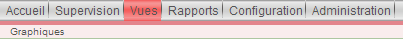

.. _ref_graph:

***************
Les graphiques
***************

Comme son nom l'indique, les graphiques permettent de visualiser l'historique d'état d'un service.

Pour les services "Traffic_*", nous avons ajouté une "courbe" ou indicateur pour récupérer l'historique de la bande passante des ports.

Nous avons créé les courbes "inBandwidth" et "outBandwidth". Voici les informations:

.. csv-table:: Info Graph
   :header: "Nom du modèle", "inBandwidth", "outBandwidth"
   :widths: 50, 30, 30

   "Nom de la source de données", "inBAndwidth", "outBandwidth"
   "Ordre", "1", "1"
   "Inverser", "Non", "Oui"
   "Couleur de la courbe (Manuel)", "#1EE045", "#FF0000"
   "Couleur de l'aire", "#1EE045", "#FF0000"
   "Transparence", "80%", "80%"
   "Remplissage", "Oui", "Oui"
   "Afficher la valeur maximale", "Oui", "Oui"
   "Afficher la moyenne", "Oui", "Oui"
   "Afficher la dernière valeur", "Oui", "Oui"

Toutes les autres options seront par défaut.

