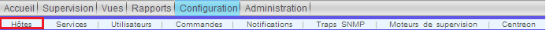
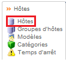
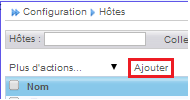
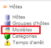
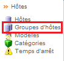

******************
Les Hôtes
******************

Pour notre projet, un hôte sera un routeur, switch,…, (le process sera le même pour tout autre équipement, comme un serveur, un PC, ...) les éléments indispensables pour la création de celui-ci sont:

	* Un nom
	* Une adresse IP
	* Son modèle
	* Pour d'autres projets, on aura besoin du type de l'équipement (serveur Linux, Windows, tout équipement IP)

La description de l'hôte sera son emplacement (ex: Paris), cette information est utile mais pas indispensable.
Le nom de l'hôte est sous la forme "RT_20nn", n est un nombre, on utilisera l'adresse IP pour remplacer les "n", ex: @ IP ==> 10.240.2.21 ==> RT_2021

Le modèle de celui-ci est très important également. Il servira à lui assigner les bons services.

Sur le réseau nous avons 4 modèles (les noms des routeurs seront imaginés) de routeurs différents: 

	* CISCO ZE-P2549-
		* 48
		* 24
	* CISCO ZE-P2549G-24
	* JUNIPER SRX24
	* JUNIPER MX5

Pour la configuration, l'ajout d'un hôte, il suffit de cliquer sur ``Configuration ==> Hôtes``

.. _ref_hote:

Création d'un hôte
-------------------

Pour la création d'un hôte, il suffit de cliquer sur *Ajouter*

Disons que nous devons créer un nouvel équipement "SW_2048" qui se trouve à Marseille, il s'agit d'un routeur Juniper MX5

Voici comment remplir le "formulaire":
	* Le nom de l'hôte : "SW_2048"
	* Alias : "Marseille"
	* Adresse IP : 10.240.2.48
	* Modèle d'hôte : "Routeur-Juniper-MX"
	* Créer ... : "Oui"

Dans l'onglet "Relations":
	* :ref:`Groupe d'hôtes <group_hote>` parents: "Routers"

Puis Sauvegarder.

L'option qui va permettre d'ajouter automatiquement :ref:`les services <ref_service>` à notre hôte est ":ref:`Modèle d'hôte <mod_hote>`", il faut cocher également "Créer aussi les services liés au modèle" pour qu'ils se greffent à notre hôte.

.. _mod_hote:

Création d'un modèle d'hôte
----------------------------

Un modèle d’hôte est un objet de supervision Centreon qui possède toutes les caractéristiques définissant un hôte et pouvant être utilisé comme base pour la configuration d’un hôte. Un modèle d’hôte est à l’hôte ce qu’un modèle de service est à un service : un objet préconfiguré pour être utilisé dans des hôtes.
Les caractéristiques sont les mêmes:
	* héritage : un hôte peut hériter d’un modèle d’hôte et un modèle d’hôte peut hériter d’un autre modèle d’hôte parent.
	* surcharge : un hôte héritant d’un modèle d’hôte peut modifier (« surcharger ») le paramètre hérité par le modèle.

Nous allons voir comment est construit le modèle d'hôte "Routeur-Juniper-MX".

Il faut cliquer sur "Ajouter".
Voici les informations à remplir dans le premier onglet "Configuration de l'hôte":
	* Nom du modèle d'hôte : 		"Routeur-Juniper-MX"
	* Alias : 					"Juniper MX Routers"
	* Communauté SNMP & Version" :	 "<communauté & version>"
	* Modèles d'hôte parallèles :		 "generic-host"

Nous mettons en héritage "generic-host" créé par défaut, qui permet de récupérer le service ping.

Puis nous passons à l'onglet "Relations", dans cet onglet, nous ajoutons les "Modèles de service liès".

Nous utiliserons pour ce modèle d'hôte les :ref:`modèles de services <mod_service>` suivant:
	* Traffic_JUNIPER_GigabitEthernet-1/0/[0-9]
	* Traffic_JUNIPER_GigabitEthernet-1/1/[0-9]

[0-9] veut dire de 0 à 9

Puis, on sauvegarde.

Pour notre projet, nous avons créé 4 modèles d'hôtes:
	* Router-Cisco : Pour les modèles de routeurs "CISCO ZE-P2549-48/24", il comprend 52 services (48 fastEthernet + 4 GigaEthernet).
	* Router-Cisco_G : Pour les modèles de routeurs " CISCO ZE-P2549G-24", il comprend 24 services (24 GigabitEthernet).
	* Routeur-Juniper-MX : Pour les modèles de routeurs " Juniper MX", il comprend 20 services (20 GigabitEthernet).
	* Router-Juniper-SRX : Pour les modèles de routeurs "Juniper SRX24", il comprend 16 services (16 GigabitEthernet).

.. _group_hote:

Groupes d'hôtes
----------------

Nous utiliserons un groupe d'hôtes prédéfinie lors de l'installation de Centreon, "Routers".

