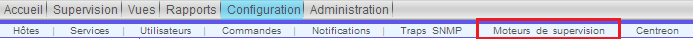
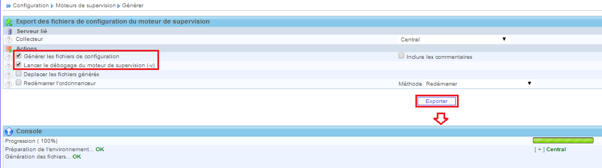
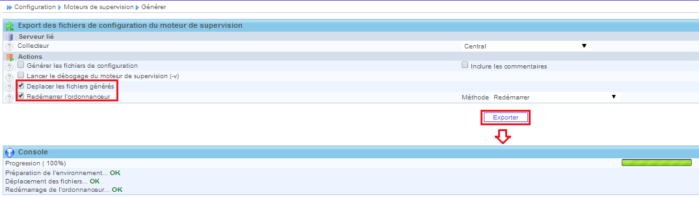

.. _ref_moteur:

*************************
Le moteur de supervision
*************************

Après un changement dans la configuration de Centreon (ajout/suppression d'hôtes, de services, ou des modifications) il est conseillé de générer les fichiers de configuration et de redémarrer l'ordonnanceur.
Voici la marche à suivre:

Ceci se fait en 2 parties:
	* 1ere partie:

On vérifie qu'aucune erreur n'apparait lors de la génération des fichiers de configuration.
Si aucune erreur, on passe à la partie 2, sinon vérifier l'erreur et régler celle-ci et recommencer depuis la partie 1 pour vérifier que tout a été arrangé.
2eme partie:

Normalement, si la première partie n'a soulevé aucun problème, cette partie sera en état "OK".

.. note::

	Il peut arriver qu'un warning apparaisse en disant que le groupe ``Guest`` ne contient pas d'utilisateur. Ceci n'est pas bloquant, il suffit de rajouter un utilisateur ou de désactiver celui-ci.
