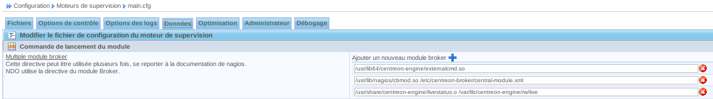

************************
Installation de NagVis
************************

NagVis va permettre de cartographier notre infrastructure et de voir en temps réel celle-ci sur une carte représentant notre réseau.

Nous allons installer les paquets à la main, le réseau de notre projet n'est pas connecté à Internet. Si votre serveur est connecté au réseau, il est conseillé d'utiliser les dépots.
Par contre, nous avons quand un dépot local, mais qui ne contient pas les paquets que nous devons installer.

Installation du broker MK Livestatus
----------------------------------------

Pour l’installer, nous devons au préalable installer un broker qui fera le lien entre NagVis et Centreon, nous allons donc récupérer MK Livestatus (version 1.2.4p5) au format «.tar.gz» que nous placerons sur notre serveur de supervision (10.220.0.16) dans le dossier  «/usr/local ».
Nous devrons compiler celui-ci et pour se faire, nous aurons besoin de certains paquets :

	* gcc
	* gcc-c++
	* kernel-devel

Pour les installer il faudra taper en ligne de commande :

.. code-block:: bash

	# yum install gcc gcc-c++ kernel-devel

Nous pouvons commencer la compilation, tout d’abord il faut décompresser l’archive , puis nous pourrons compiler :

.. code-block:: bash

	# tar zxvf mk-livestatus-1.2.4p5.tar.gz
	# cd mk-livestatus-1.2.4p5
	# ./configure
	# make

Une fois la compilation terminée, vous devrez placer le binaire du broker dans le dossier du moteur de supervision. Vous ajouterez l'utilitaire unixcat permettant la vérification du socket Unix.

.. code-block:: bash

	# cp src/livestatus.o  /usr/share/centreon-engine
	# cp src/unixcat  /usr/share/centreon-engine

Configuration de l’interface Centreon
-------------------------------------------

Onglet Data, rajoutez un module broker en cliquant sur la croix. Saisir la ligne suivante :

.. code-block:: bash

	/usr/share/centreon-engine/livestatus.o  /var/lib/centreon-engine/rw/live

Ensuite, appliquez la configuration et vérifiez le bon fonctionnement du module en visualisant le fichier de log ``/var/log/centreon-engine/centengine.log``

.. code-block:: bash

	[1337663836] livestatus: Livestatus 1.1.12p7 by Mathias Kettner. Socket:  '/var/lib/centreon-engine/rw/live‘ 
	[1337663836] livestatus: Please visit us at http://mathias-kettner.de/
	[1337663836] livestatus: Hint: please try out OMD - the Open Monitoring Distribution
	[1337663836] livestatus: Please visit OMD at http://omdistro.org
	[1337663836] livestatus: Cannot open log archive '/usr/local/nagios/var/archives/'
	[1337663836] livestatus: Finished initialization. Further log messages go to /var/log/centreon-engine/livestatus.log
	[1337663836] Event broker module '/usr/share/centreon-engine/livestatus.o' initialized successfully.
	[1337663836] livestatus: Timeperiod cache not updated, there are no timeperiods (yet)

Par défaut, MK livestatus crée un fichier de log dans ``/var/log/centreon-engine/livestatus.log``. Nous pouvons vérifier le fonctionnement du broker avec cette commande. Vous devrez avoir un résultat. 

Attention, utilisez l'utilitaire unixcat que vous avez compilé mais pas celui fournit avec la distribution Debian. 
Il ne fonctionne pas avec MK livestatus.

.. code-block:: bash

	echo "GET hosts" | /usr/local/nagios/bin/unixcat   /var/lib/centreon-engine/rw/live

Puis redémarrer le moteur de supervision.

Installation de Graphviz
--------------------------------

Nous devons récupérer ce paquet pour permettre à NagVis de créer ses cartes. L’archive à récupérer est ``graphviz-2.38.0.tar.gz`` que nous copions dans ``/usr/local``.

.. code-block:: bash

	# cd /usr/local
	# tar zxvf graphviz-2.38.0.tar.gz
	# cd graphviz-2.3.8.0
	# ./configure
	# make
	# make install

Installation de NagVis
-----------------------------

Continuons par l'installation de Nagvis. Nous utiliserons la dernière version 1.7.10 pour la version stable. Récupérez l'archive (``nagvis-1.7.10.tar.gz``) pour la copier dans ``/usr/local``

.. code-block:: bash

	# cd /usr/local
	# tar zxvf nagvis-1.7.10.tar.gz
	# mv nagvis-1.7.10   nagvis
	# cd nagvis

Lorsque nous sommes dans ce fichier, nous devons lancer la commande d’installation.

.. code-block:: bash

	# ./install.sh  -l  unix:/var/lib/centreon-engine/rw/live

L’option ``-l`` permet de forcer l’installation du socket unix hors du dossier par défaut.

Voici les réponses à donner lors des quelques questions :

	#. proceed ==> *y*
	#. nagios base directory ==> */usr/share/centreon-engine*
	#. path to NagVis ==> */usr/local/nagvis*
	#. Do you want to use backend mklivestatus ? ==> *y (et n pour les autres)*
	#. Répondre oui pour la suite ainsi que les réponses par défaut.

Si probleme avec mklivestatus, on peut changer les informations après l’installation en allant dans ``/usr/local/nagvis/etc/nagios.ini.php`` et on recherche ``backend_live_1`` et entrer :

.. code-block:: bash

	socket= «unix:/var/lib/centreon-engine/rw/live»

Pour prendre en compte les modifications ainsi que les nouvelles installations, nous devons redémarrer apache :

.. code-block:: bash

	# service httpd restart
	

