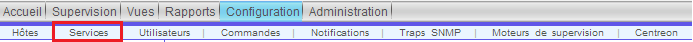
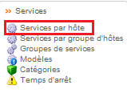
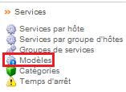

.. _ref_service:

***************
Les services
***************

Les services sont des indicateurs que nous mettons sur nos hôtes pour vérifier si tel ou tel fonction de notre hôte fonctionne. Le service le plus commun et utilisé sur pratiquement tous les équipements est le "ping". Ce service va nous permettre de vérifier que l'équipement répond. 
Nous pouvons choisir le temps entre 2 "ping", entre autre. Nous verrons plus loin comment créer ceux-ci.

Les services par hôte
-----------------------

Cette configuration n'est pas utilisée dans notre projet !
Ceci permet d'implanter un service à un hôte et seulement un hôte, il est préférable d'utiliser :ref:`les services par groupes d'hôte <serv_group_hote>` ou :ref:`les modèles de service <mod_service>`.

Nous utiliserons ce menu pour désactiver certains services.

.. _serv_group_hote:

Les services par groupe d'hôtes
--------------------------------------

Cette configuration n'est pas utilisée dans notre projet !

.. note::

	**Nous verrons plus tard pour ajouter des informations sur cette configuration**

.. _mod_service:

Création d'un modèle de service
-----------------------------------

Nous allons voir comment créer un modèle de service.

Nous voulons superviser les ports sur les routeurs/commutateurs de notre réseau, le plugin utilisé est "/usr/lib/nagios/plugins/check_iftraffic3.pl" qui remonte la bande passante du port, ainsi que le statut administratif/opérationnel de celui-ci (le plugin a été modifié pour remonter cette dernière information). 
Nous mettons en relation ce plugin avec la :ref:`commande <ref_commandes>` "check_traffic".

Nous créons un modèle de service "générique" pour le trafic, "Traffic_CISCO" (il sera utilisé aussi pour les Juniper).

Nous ajoutons donc un modèle en cliquant sur "Ajouter".
Voici les informations que nous avons rentré dans le premier onglet, "Configuration du service":
	* Alias :							"Traffic_CISCO"
	* Nom du modèle de service : 				"Traffic_CISCO"
	* Modèle de service : 					"generic-service"
	* Est volatile : 						"Non"
	* Période de contrôle : 					"24x7"
	* Commande de vérification : 				"check_traffic"
	* Nombre de contrôle avant validation de l'état : 	"5"
	* Intervalle normal de contrôle :				"5"
	* Intervalle non-régulier de contrôle : 			"1"

Le reste est par défaut.

Dans l'onglet "Informations supplémentaires du service", dans ":ref:`Modèle de graphique <ref_graph>`", on ajoute "Traffic".

On peut sauvegarder.

Puis l'on crée des modèles de service moins générique qui vont hériter de "Traffic_CISCO".
Nous allons avoir 4 "familles" de modèles suivant le nom donnés par les routeur/commutateurs pour les ports.
	* Traffic_Cisco_FastEthernet-1/0/[1-48]
	* Traffic_Cisco_GigabitEthernet-1/0/[1-24]
	* Traffic_JUNIPER_GigabitEthernet-1/[0-1]/[0-9]
	* Traffic_JUNIPER_GigabitEthernet-0/0/[0-15]

