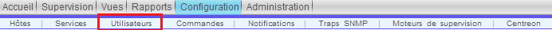

.. _ref_users:

*****************
Les utilisateurs
*****************

Il est conseiller de créer un compte qui aura moins de droits que le compte ``admin`` par défaut et de créer des droits d'accès (ACL) spécifiques.
Se qui permettra de laisser la supervision à un groupe des personnes qui auront seulement le droit de voir les alarmes et au cas où les acquitter.

Pour la création il suffit de suivre chaque option et les remplir. Si vous avez suivi l'installation depuis le site de Centreon, vous aurez la possibilité de choisir la langue française.

